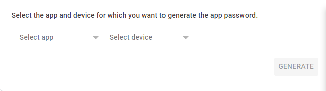

# Ad Subscription Service

Provides an opportunity to subscribe on sales ads to track changes in the price of the ad and send notification if some changes

<ins><br> Supported website:</ins>
<ul>
  <li>ebay.com</li>
</ul>

App works on port ```8080```
<br>Receive requests by POST-method in JSON format
```bash
{
    "link": "https://www.ebay.com/itm/some_id",
    "email": "smt@smt.com"
}
```

## Getting Started
Set environment variable in file ```.env```
<ins><br>go-service</ins>
<ul>
 <li>HOSTEMAIL</li>
 <li>HOSTPASSWORD</li>
 <li>HOST</li>
 <li>HOSTEMAIL</li>
</ul>

<ins>postgresdb</ins>
<ul>
 <li>POSTGRES_USER</li>
 <li>POSTGRES_PASSWORD</li>
 <li>POSTGRES_DB</li>
</ul>

Than move to /docker-compose folder and run:
```bash
[sudo] docker-compose up --build
```
<br>Send request POST-method by Postman

```http://localhost:8080/subscrution``` + JSON Raw data

## Gmail Account
If you use Gmail for sending notification, you can get error as below
>535-5.7.8 Username and Password not accepted

Google stopped allowing apps logging in to Gmail using real password
>After 30 May 2022 you can't login with username and password alone to Gmail. Less secure app access is not available anymore unless you have Google Workspace or Google Cloud Identity.

You need to make a password for specific app

<ul>
 <li><a href="https://myaccount.google.com/signinoptions/two-step-verification/enroll-welcome">Step one</a>: enable 2FA</li>
 <li><a href="https://myaccount.google.com/apppasswords">Step two</a>: create an app-specific password</li>
</ul>



After this, use that 16 digit